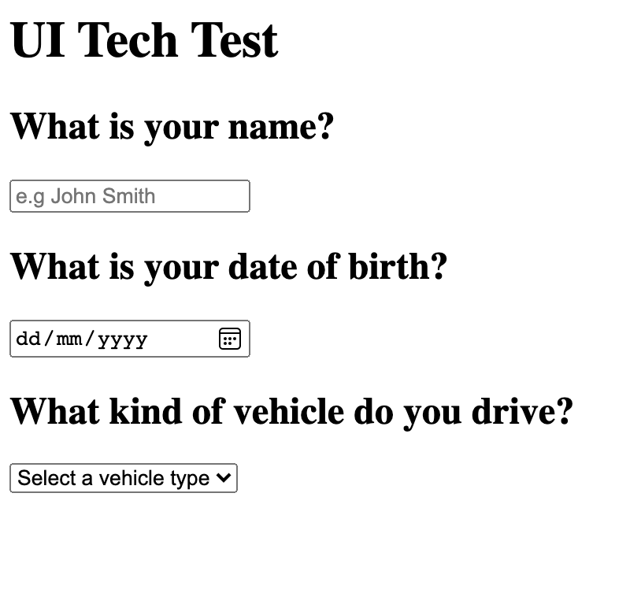

# Tech Test

Consume the JSON file provided at `api.json` and generate a question list UI from the data it describes.

Visually generate something like the image below, using any technology you want. Google is allowed! :)

As a plus add some styling, though not strictly necessary.

## Setup
Use a local web server to point to the files in `/src/`

If you have node installed you should be able to `npm install && npm start` to spin up a local server using the `http-server` module.

## Generate a UI like the following

